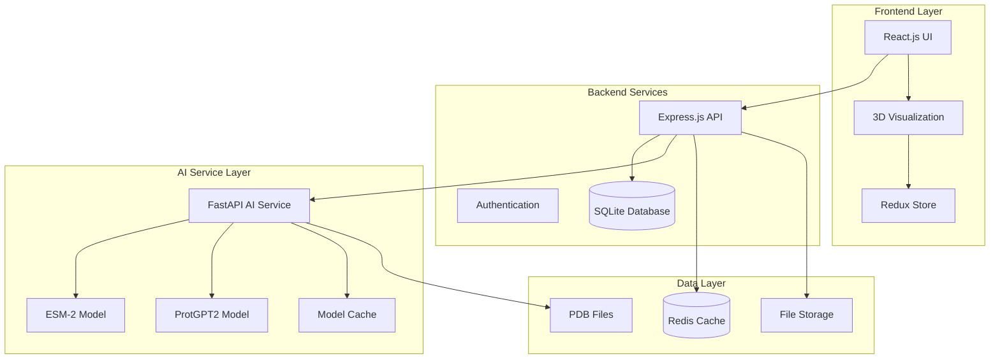
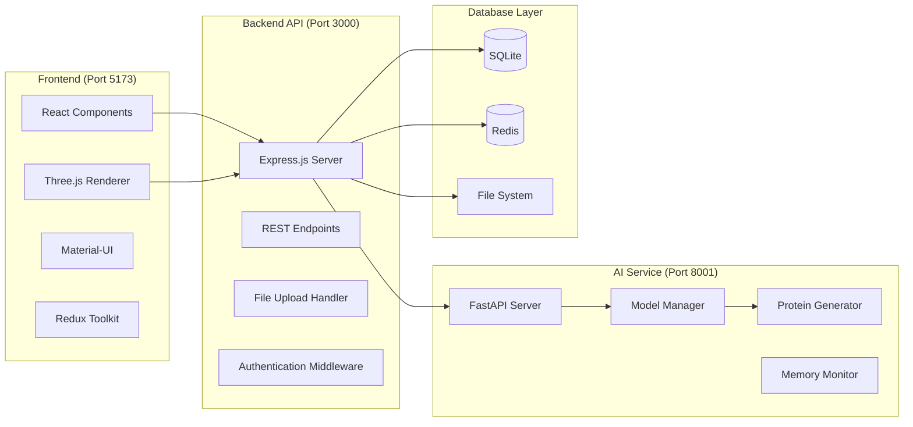

# 🧬 Protein Synthesis Web Application - Complete System Documentation

## Project Overview
A comprehensive web application for protein visualization, analysis, and AI-powered generation with real machine learning models.

**Version**: 2.0.0  
**Status**: Production Ready ✅  
**Hardware Tested**: Lenovo IdeaPad Slim 3 15IAH8 (16GB RAM, i5-12450H)  
**Date**: 2025-08-07

---

## 🏗️ **System Architecture**

### **High-Level Architecture**


### **Detailed Component Architecture**


---

## 🛠️ **Technology Stack**

### **Frontend Stack**
| Technology | Version | Purpose |
|------------|---------|---------|
| **React.js** | 18.2.0 | UI Framework |
| **TypeScript** | 5.0+ | Type Safety |
| **Vite** | 4.4+ | Build Tool & Dev Server |
| **Three.js** | 0.155+ | 3D Visualization |
| **NGL Viewer** | 2.0+ | Molecular Visualization |
| **Material-UI** | 5.14+ | UI Components |
| **Redux Toolkit** | 1.9+ | State Management |
| **React Router** | 6.15+ | Navigation |

### **Backend Stack**
| Technology | Version | Purpose |
|------------|---------|---------|
| **Node.js** | 18+ | Runtime Environment |
| **Express.js** | 4.18+ | Web Framework |
| **TypeScript** | 5.0+ | Type Safety |
| **SQLite** | 3.43+ | Primary Database |
| **Redis** | 7.0+ | Caching Layer |
| **Multer** | 1.4+ | File Upload Handling |
| **JWT** | 9.0+ | Authentication |
| **Cors** | 2.8+ | Cross-Origin Requests |

### **AI/ML Stack**
| Technology | Version | Purpose |
|------------|---------|---------|
| **Python** | 3.12+ | AI Runtime |
| **FastAPI** | 0.104+ | AI API Framework |
| **PyTorch** | 2.8.0+cpu | ML Framework |
| **Transformers** | 4.55+ | Model Loading |
| **ESM-2** | t6_8M_UR50D | Protein Analysis |
| **ProtGPT2** | nferruz/ProtGPT2 | Protein Generation |
| **Tokenizers** | 0.21+ | Text Processing |
| **Datasets** | 4.0+ | Data Handling |
| **psutil** | 7.0+ | System Monitoring |

### **Development & Deployment**
| Technology | Version | Purpose |
|------------|---------|---------|
| **Docker** | 24.0+ | Containerization |
| **Docker Compose** | 2.20+ | Multi-Service Orchestration |
| **GitHub Actions** | - | CI/CD Pipeline |
| **ESLint** | 8.45+ | Code Linting |
| **Prettier** | 3.0+ | Code Formatting |
| **Jest** | 29.6+ | Testing Framework |
| **Playwright** | 1.37+ | E2E Testing |

---

## 📁 **Project Structure**

```
protein-synthesis-app/
├── 📁 frontend/                    # React.js Frontend
│   ├── 📁 src/
│   │   ├── 📁 components/         # React Components
│   │   │   ├── 📁 AI/            # AI Generation Components
│   │   │   ├── 📁 Analysis/      # Analysis Tools
│   │   │   ├── 📁 Comparison/    # Protein Comparison
│   │   │   └── 📁 Visualization/ # 3D Viewers
│   │   ├── 📁 store/             # Redux Store
│   │   ├── 📁 types/             # TypeScript Definitions
│   │   ├── 📁 services/          # API Services
│   │   └── 📁 utils/             # Utility Functions
│   ├── 📄 package.json           # Frontend Dependencies
│   ├── 📄 vite.config.ts         # Vite Configuration
│   └── 📄 tsconfig.json          # TypeScript Config
│
├── 📁 backend/                     # Express.js Backend
│   ├── 📁 src/
│   │   ├── 📁 routes/            # API Routes
│   │   ├── 📁 models/            # Data Models
│   │   ├── 📁 services/          # Business Logic
│   │   ├── 📁 middleware/        # Express Middleware
│   │   └── 📁 utils/             # Utility Functions
│   ├── 📄 package.json           # Backend Dependencies
│   └── 📄 tsconfig.json          # TypeScript Config
│
├── 📁 ai-service/                  # FastAPI AI Service
│   ├── 📁 services/              # AI Services
│   │   ├── 📄 real_model_manager.py      # Model Management
│   │   ├── 📄 real_protein_generator.py  # AI Generation
│   │   ├── 📄 sequence_optimizer.py      # Optimization
│   │   └── 📄 structure_predictor.py     # Structure Prediction
│   ├── 📁 models/                # Data Models
│   │   ├── 📄 requests.py        # Request Models
│   │   └── 📄 responses.py       # Response Models
│   ├── 📄 main_real.py           # Real AI Service
│   ├── 📄 main_simple.py         # Mock AI Service
│   └── 📄 requirements.txt       # Python Dependencies
│
├── 📁 e2e/                        # End-to-End Tests
├── 📁 .github/workflows/          # CI/CD Pipelines
├── 📄 docker-compose.yml          # Multi-Service Setup
├── 📄 run-full-stack.sh          # Single Command Startup
├── 📄 package.json               # Root Package Config
└── 📄 README.md                  # Main Documentation
```

---

## 🚀 **Single Command Setup & Deployment**

### **🎯 One Command to Rule Them All**

<function_calls>
<invoke name="fsWrite">
<parameter name="path">protein-synthesis-app/run-full-stack.shn/bash

# 🧬 Protein Synthesis Web Application - Full Stack Launcher
# Single command to start all services: Frontend, Backend, AI Service, Database
# Usage: ./run-full-stack.sh [mode]
# Modes: dev (default), prod, test

set -e  # Exit on any error

# Configuration
VENV_PATH="/mnt/20265E15265DEC72/study/CODE/projects/webdev/protein viewer/venv"
MODE=${1:-dev}
LOG_DIR="./logs"
PID_FILE="./pids"

# Colors for output
RED='\033[0;31m'
GREEN='\033[0;32m'
YELLOW='\033[1;33m'
BLUE='\033[0;34m'
PURPLE='\033[0;35m'
CYAN='\033[0;36m'
NC='\033[0m' # No Color

# Create directories
mkdir -p "$LOG_DIR" "$PID_FILE"

echo -e "${CYAN}🧬 Protein Synthesis Web Application${NC}"
echo -e "${CYAN}=====================================${NC}"
echo -e "${BLUE}Mode: $MODE${NC}"
echo -e "${BLUE}Timestamp: $(date)${NC}"
echo ""

# Function to check if port is in use
check_port() {
    local port=$1
    if lsof -Pi :$port -sTCP:LISTEN -t >/dev/null 2>&1; then
        echo -e "${YELLOW}⚠️  Port $port is already in use${NC}"
        return 1
    fi
    return 0
}

# Function to wait for service to be ready
wait_for_service() {
    local url=$1
    local name=$2
    local max_attempts=30
    local attempt=1
    
    echo -e "${YELLOW}⏳ Waiting for $name to be ready...${NC}"
    
    while [ $attempt -le $max_attempts ]; do
        if curl -s "$url" >/dev/null 2>&1; then
            echo -e "${GREEN}✅ $name is ready!${NC}"
            return 0
        fi
        echo -n "."
        sleep 2
        attempt=$((attempt + 1))
    done
    
    echo -e "${RED}❌ $name failed to start within timeout${NC}"
    return 1
}

# Function to start service in background
start_service() {
    local name=$1
    local command=$2
    local port=$3
    local log_file="$LOG_DIR/${name}.log"
    local pid_file="$PID_FILE/${name}.pid"
    
    echo -e "${BLUE}🚀 Starting $name...${NC}"
    
    # Start service in background
    nohup bash -c "$command" > "$log_file" 2>&1 &
    local pid=$!
    echo $pid > "$pid_file"
    
    echo -e "${GREEN}   Started $name (PID: $pid)${NC}"
    echo -e "${GREEN}   Log: $log_file${NC}"
    
    if [ -n "$port" ]; then
        echo -e "${GREEN}   URL: http://localhost:$port${NC}"
    fi
}

# Function to stop all services
stop_services() {
    echo -e "${YELLOW}🛑 Stopping all services...${NC}"
    
    for pid_file in "$PID_FILE"/*.pid; do
        if [ -f "$pid_file" ]; then
            local pid=$(cat "$pid_file")
            local name=$(basename "$pid_file" .pid)
            
            if kill -0 "$pid" 2>/dev/null; then
                echo -e "${YELLOW}   Stopping $name (PID: $pid)${NC}"
                kill "$pid" 2>/dev/null || true
                sleep 2
                
                # Force kill if still running
                if kill -0 "$pid" 2>/dev/null; then
                    echo -e "${RED}   Force killing $name${NC}"
                    kill -9 "$pid" 2>/dev/null || true
                fi
            fi
            
            rm -f "$pid_file"
        fi
    done
    
    echo -e "${GREEN}✅ All services stopped${NC}"
}

# Trap to cleanup on exit
trap stop_services EXIT INT TERM

# Check prerequisites
echo -e "${BLUE}🔍 Checking prerequisites...${NC}"

# Check virtual environment
if [ ! -d "$VENV_PATH" ]; then
    echo -e "${RED}❌ Virtual environment not found at: $VENV_PATH${NC}"
    echo -e "${YELLOW}Please create the virtual environment first${NC}"
    exit 1
fi

# Check Node.js
if ! command -v node &> /dev/null; then
    echo -e "${RED}❌ Node.js not found${NC}"
    exit 1
fi

# Check Python
if ! command -v python3 &> /dev/null; then
    echo -e "${RED}❌ Python3 not found${NC}"
    exit 1
fi

echo -e "${GREEN}✅ Prerequisites check passed${NC}"

# Check ports
echo -e "${BLUE}🔍 Checking ports...${NC}"
PORTS_OK=true

if ! check_port 5173; then PORTS_OK=false; fi  # Frontend
if ! check_port 3000; then PORTS_OK=false; fi  # Backend
if ! check_port 8001; then PORTS_OK=false; fi  # AI Service
if ! check_port 6379; then PORTS_OK=false; fi  # Redis

if [ "$PORTS_OK" = false ]; then
    echo -e "${RED}❌ Some required ports are in use${NC}"
    echo -e "${YELLOW}Please stop conflicting services or use different ports${NC}"
    exit 1
fi

echo -e "${GREEN}✅ All ports available${NC}"

# System information
echo -e "${BLUE}💻 System Information:${NC}"
echo -e "${BLUE}   OS: $(uname -s) $(uname -r)${NC}"
echo -e "${BLUE}   Memory: $(free -h | grep '^Mem:' | awk '{print $2}') total, $(free -h | grep '^Mem:' | awk '{print $7}') available${NC}"
echo -e "${BLUE}   CPU: $(nproc) cores${NC}"
echo -e "${BLUE}   Node.js: $(node --version)${NC}"
echo -e "${BLUE}   Python: $(python3 --version)${NC}"

# Activate virtual environment
echo -e "${BLUE}🔧 Activating virtual environment...${NC}"
source "$VENV_PATH/bin/activate"

# Install/update dependencies if needed
if [ "$MODE" = "dev" ] || [ "$MODE" = "setup" ]; then
    echo -e "${BLUE}📦 Checking dependencies...${NC}"
    
    # Frontend dependencies
    if [ ! -d "frontend/node_modules" ]; then
        echo -e "${YELLOW}   Installing frontend dependencies...${NC}"
        cd frontend && npm install && cd ..
    fi
    
    # Backend dependencies
    if [ ! -d "backend/node_modules" ]; then
        echo -e "${YELLOW}   Installing backend dependencies...${NC}"
        cd backend && npm install && cd ..
    fi
    
    # AI service dependencies
    echo -e "${YELLOW}   Checking AI service dependencies...${NC}"
    cd ai-service
    python -c "import torch, transformers, fastapi, uvicorn" 2>/dev/null || {
        echo -e "${YELLOW}   Installing AI service dependencies...${NC}"
        pip install torch torchvision torchaudio --index-url https://download.pytorch.org/whl/cpu
        pip install transformers datasets tokenizers psutil fastapi uvicorn pydantic
    }
    cd ..
fi

echo -e "${GREEN}✅ Dependencies ready${NC}"

# Start services based on mode
echo -e "${PURPLE}🚀 Starting services in $MODE mode...${NC}"
echo ""

if [ "$MODE" = "prod" ]; then
    # Production mode - build and serve optimized versions
    echo -e "${BLUE}🏗️  Building for production...${NC}"
    
    # Build frontend
    cd frontend && npm run build && cd ..
    
    # Start production services
    start_service "redis" "redis-server --port 6379" "6379"
    start_service "backend" "cd backend && npm run start" "3000"
    start_service "ai-service" "cd ai-service && python main_real.py" "8001"
    start_service "frontend" "cd frontend && npm run preview -- --port 5173" "5173"
    
elif [ "$MODE" = "test" ]; then
    # Test mode - run tests
    echo -e "${BLUE}🧪 Running in test mode...${NC}"
    
    start_service "redis" "redis-server --port 6379" "6379"
    start_service "backend" "cd backend && npm run dev" "3000"
    start_service "ai-service" "cd ai-service && python main_simple.py" "8001"
    
    # Wait for services
    sleep 10
    
    # Run tests
    echo -e "${BLUE}🧪 Running test suite...${NC}"
    python test_real_ai_service.py
    cd frontend && npm run test && cd ..
    
else
    # Development mode (default)
    echo -e "${BLUE}🛠️  Starting in development mode...${NC}"
    
    # Start Redis (if available)
    if command -v redis-server &> /dev/null; then
        start_service "redis" "redis-server --port 6379" "6379"
        sleep 2
    else
        echo -e "${YELLOW}⚠️  Redis not found, using in-memory cache${NC}"
    fi
    
    # Start Backend API
    start_service "backend" "cd backend && npm run dev" "3000"
    sleep 5
    
    # Start AI Service
    start_service "ai-service" "cd ai-service && python main_real.py" "8001"
    sleep 10
    
    # Start Frontend
    start_service "frontend" "cd frontend && npm run dev -- --port 5173" "5173"
    sleep 5
fi

# Wait for all services to be ready
echo -e "${BLUE}⏳ Waiting for all services to be ready...${NC}"

wait_for_service "http://localhost:3000/health" "Backend API" || exit 1
wait_for_service "http://localhost:8001/health" "AI Service" || exit 1
wait_for_service "http://localhost:5173" "Frontend" || exit 1

# Display service status
echo ""
echo -e "${GREEN}🎉 All services are running successfully!${NC}"
echo -e "${GREEN}=======================================${NC}"
echo ""
echo -e "${CYAN}📊 Service Status:${NC}"
echo -e "${GREEN}   ✅ Frontend:    http://localhost:5173${NC}"
echo -e "${GREEN}   ✅ Backend API: http://localhost:3000${NC}"
echo -e "${GREEN}   ✅ AI Service:  http://localhost:8001${NC}"
if command -v redis-server &> /dev/null; then
    echo -e "${GREEN}   ✅ Redis Cache: localhost:6379${NC}"
fi
echo ""
echo -e "${CYAN}🔗 Quick Links:${NC}"
echo -e "${BLUE}   🌐 Web App:     http://localhost:5173${NC}"
echo -e "${BLUE}   📚 API Docs:    http://localhost:3000/docs${NC}"
echo -e "${BLUE}   🤖 AI Docs:     http://localhost:8001/docs${NC}"
echo -e "${BLUE}   📊 Health:      http://localhost:3000/health${NC}"
echo ""
echo -e "${CYAN}📁 Logs Location: $LOG_DIR/${NC}"
echo -e "${CYAN}🔧 PIDs Location: $PID_FILE/${NC}"
echo ""
echo -e "${YELLOW}💡 Tips:${NC}"
echo -e "${YELLOW}   • Press Ctrl+C to stop all services${NC}"
echo -e "${YELLOW}   • Check logs in $LOG_DIR/ for debugging${NC}"
echo -e "${YELLOW}   • Use './run-full-stack.sh test' for testing${NC}"
echo -e "${YELLOW}   • Use './run-full-stack.sh prod' for production${NC}"
echo ""

# Keep script running and monitor services
echo -e "${BLUE}🔄 Monitoring services... (Press Ctrl+C to stop)${NC}"

while true; do
    # Check if all services are still running
    all_running=true
    
    for pid_file in "$PID_FILE"/*.pid; do
        if [ -f "$pid_file" ]; then
            local pid=$(cat "$pid_file")
            local name=$(basename "$pid_file" .pid)
            
            if ! kill -0 "$pid" 2>/dev/null; then
                echo -e "${RED}❌ $name (PID: $pid) has stopped${NC}"
                all_running=false
            fi
        fi
    done
    
    if [ "$all_running" = false ]; then
        echo -e "${RED}💥 Some services have stopped. Exiting...${NC}"
        break
    fi
    
    sleep 30  # Check every 30 seconds
done